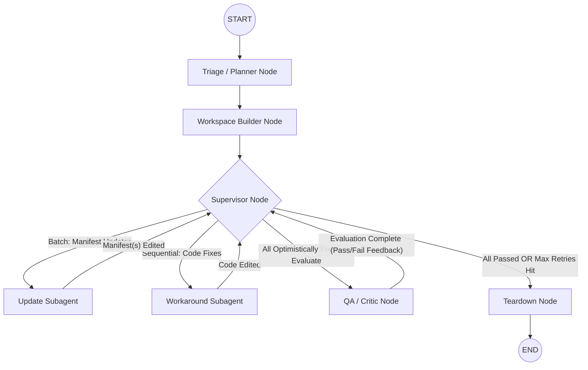

# 🏗️ High-Level Design: Hierarchical Agentic AppSec Remediation Engine

## 1. Graph Topology (LangGraph Architecture)
The architecture utilizes a strict **Hub-and-Spoke (Star) Topology**. The Supervisor acts as the central router, preventing subagents from polluting each other's context windows and ensuring a single source of truth for the final Git Diff.

---

## 2. Node-by-Node Responsibilities

### 🧠 1. The Supervisor Node (The Orchestrator)
*   **Role:** The project manager. It segregates vulnerability groups, enforces security rules, and manages execution. It evaluates feedback from the QA node to decide if a fix needs a retry or if the pipeline is complete.
*   **Routing Strategy:** 
    *   Routes **SCA Version Bumps** as a *Batch* to the Update Subagent (allowing holistic peer-dependency resolution).
    *   Routes **SAST & SCA Workarounds** *Sequentially* (one vulnerability group at a time) to the Workaround Subagent (preventing context hallucination).
*   **Tools:** None. (Uses LangChain Structured Output to control graph edges).

### 📦 2. The Update Subagent (Dependencies / SCA)
*   **Role:** A specialist agent that modifies package manifests to resolve dependency vulnerability groups while respecting the existing dependency tree.
*   **Inline Validation:** Runs fast math/lockfile checks (`npm install --package-lock-only`) to catch JSON corruption or immediate `ERESOLVE` peer conflicts in ~2 seconds.
*   **Tools:** `read_repository_map`, `modify_npm_dependency`, `revert_workspace_file`.

### 🛠️ 3. The Workaround Subagent (Codebase / SAST)
*   **Role:** A specialist agent that handles surgical, logic-level codebase rewrites to avoid vulnerable execution paths.
*   **Inline Validation:** Runs fast syntax compilation (e.g., `node -c` or `tsc --noEmit`) to catch hallucinated syntax.
*   **Tools:** `read_repository_map`, `search_codebase_pattern`, `inspect_ast_symbol`, `deterministic_search_replace`, `revert_workspace_file`.

### 🛡️ 4. The QA / Critic Node (The Reviewer)
*   **Role:** An independent AI Evaluator. It executes heavy disk-I/O infrastructure *once* per batch, parses raw logs, attributes failures to specific CVEs, and acts as an AI Peer Reviewer.
*   **Tools:** 
    *   *Execution:* `run_dependency_install`, `run_security_scan`, `run_unit_tests`.
    *   *Read-Only Context:* `generate_workspace_diff`, `read_file_context`, `query_test_logs`.

### 🧹 5. The Teardown Node
*   **Role:** Compares the modified Docker volume against the host baseline, generates the final pristine Git Diff, safely destroys the container, and emits the final JSON report.

---

## 3. State Management (The Contract)

To prevent LLMs from drowning in each other's trial-and-error logs, state is strictly divided:

*   **Master State (Supervisor):**
    *   `valid_groups`: The list of triaged vulnerability groups actively being processed.
    *   `constraints_ledger`: Security rules established by successful fixes (e.g., *"Library A MUST be >= 2.0.0"*). Prevents future regression loops.
    *   `retry_counts`: Tracks how many times a specific vulnerability group has failed QA (max 3 retries).
*   **Ephemeral State (Subagents):**
    *   Each subagent has a private `messages` ReAct loop. Once a fix is applied, this memory is deleted. The subagent only yields an `action_summary` (e.g., *"Bumped lodash to 4.3.2"*) and `changed_files` back to the Master State.

---

## 4. The Execution Workflow (Hybrid Deferred QA)

1.  **Segregation:** Supervisor separates vulnerability groups into *Version Bumps* (Batch) and *Code Workarounds* (Sequential).
2.  **Optimistic Execution:** Subagents perform text/JSON edits and execute 2-second inline validations.
3.  **Deferred Heavy QA:** Once all vulnerability groups are tentatively completed, Supervisor triggers the QA Critic. The Critic runs the 2-minute `npm install`, OWASP scan, and test suite.
4.  **Evaluation & Smart Blame:** 
    *   If a test/scan fails, the QA Critic determines *which* specific vulnerability group caused the failure and generates targeted feedback.
5.  **The Retry Loop:** Supervisor routes the failed vulnerability group back to the respective subagent with the Critic's feedback for a new approach.
6.  **Finalization:** Once QA returns `all_passed` (or groups hit the retry limit), the Supervisor routes to Teardown.

***

## 🚀 5. Future Improvements (Complex Edge Case Handling)

While the base architecture handles standard remediations natively, the Supervisor's "Reactive State Machine" will be expanded in future iterations to handle the following complex enterprise scenarios:

### A. Dynamic Strategy Reclassification (Irresolvable Conflicts)
*   **Scenario:** Bumping a package fails due to an unresolvable peer-dependency conflict (`ERESOLVE`) or because the package is **abandoned** (no patched version exists).
*   **Planned Logic:** When the Update Subagent surrenders, the Supervisor will automatically mutate the vulnerability group's strategy from `VERSION_BUMP` to `CODE_WORKAROUND`. The group is then re-routed to the Workaround Subagent to rewrite the application code to avoid the vulnerable function entirely.

### B. Cross-Agent Chaining (Major Version Breaking Changes)
*   **Scenario:** A successful version bump introduces an API breaking change, causing the test suite to fail (e.g., Express v3 to v4).
*   **Planned Logic:** The QA Critic will classify the test failure as a `BREAKING_CHANGE`. The Supervisor will lock the version bump in the `constraints_ledger`, append a refactoring mandate to the vulnerability group, and route it to the Workaround Subagent to update the application's source code to comply with the new API.

### C. Multi-Signal Verification (The Workaround/Scan Paradox)
*   **Scenario:** The Workaround Subagent successfully mitigates an SCA vulnerability via a codebase rewrite, but the manifest scanner (ODC) predictably still flags the unpatched `package.json`.
*   **Planned Logic:** The QA Critic will use `generate_workspace_diff` to perform an LLM-driven Peer Review on the changed code. If the Critic determines the code effectively neutralizes the threat (and exploit tests pass), it will safely suppress the ODC flag as an Expected False Positive.

### D. Environmental Constraints (`EBADENGINE`)
*   **Scenario:** Fixing a CVE requires a package version that strictly demands a newer Node.js runtime than the Docker Sandbox currently possesses.
*   **Planned Logic:** The Update Subagent will detect the `EBADENGINE` crash during inline validation. The Supervisor will recognize this as a hard infrastructure constraint, immediately revert the bump, and pivot the vulnerability group's strategy to a `CODE_WORKAROUND`.

### E. Lockfile Drift Resolution
*   **Scenario:** The `package.json` allows the patched version (e.g., `^4.1.0`), but the `package-lock.json` is pinned to a vulnerable version.
*   **Planned Logic:** The Update Subagent will be trained to recognize valid manifest ranges and natively run targeted updates (e.g., `npm update <pkg>`) to resolve the drift without redundantly modifying the manifest text.

### F. DevDependency Risk Forgiveness
*   **Scenario:** Bumping a `devDependency` (e.g., Webpack, Jest) to fix a low-risk CVE introduces massive breaking changes to the CI pipeline.
*   **Planned Logic:** The Supervisor will weigh the `system_context` (Dev vs Prod). If the cost of refactoring the test suite outweighs the security risk of a dev-time vulnerability, the Supervisor will revert the fix, mark the vulnerability group as `RISK_ACCEPTED`, and proceed without failing the overall pipeline.